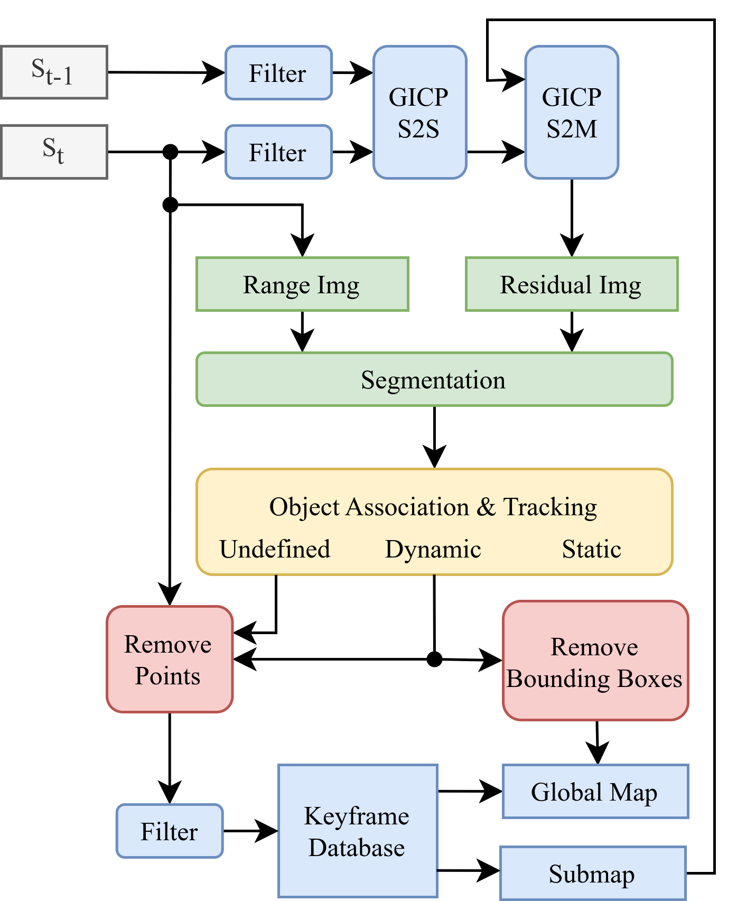
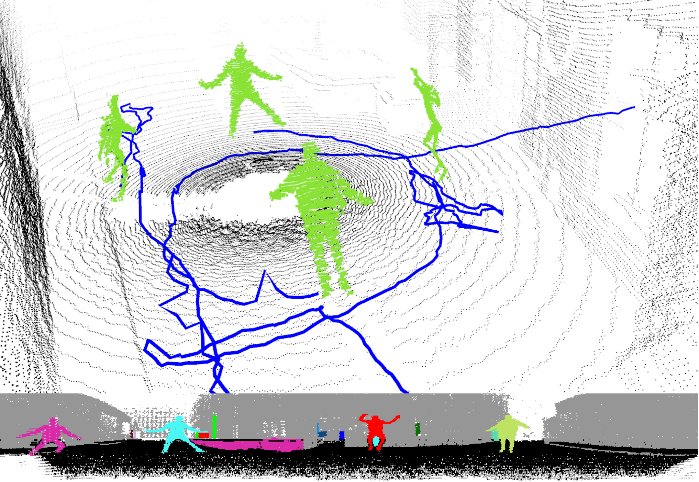

# Dynamic Direct LiDAR Odometry: Dynamic LiDAR Odometry for Mobile Robots in Urban Search and Rescue Environments

#### [[ArXiv](https://arxiv.org/abs/2411.18443)]

This repository contains the source code to the IROS paper _Dynamic LiDAR Odometry for Mobile Robots in Urban Search and Rescue Environments_.
It extends the [Direct LiDAR Odometry](https://github.com/vectr-ucla/direct_lidar_odometry) framework to detect dynamic objects in the LiDAR scans, track them individually and remove them from the map.

<p align='center'>
    
    
</p>

## Instructions
As input, structured point clouds are required (_sensor_msgs::PointCloud2_). We recommend to use a LiDAR scanner with at least 64 scan lines. IMU data can be used optionally for initial ground alignment.

### System
We tested our system on Ubuntu 20.04 with ROS Noetic.

### Compiling
Clone the repository into the src folder of your catkin workspace and build it with catkin.
```sh
git clone https://github.com/tu-darmstadt-ros-pkg/dynamic_direct_lidar_odometry.git
catkin build
```

### Datasets
You can find the _kantplatz_ dataset presented in the paper [here](https://tudatalib.ulb.tu-darmstadt.de/handle/tudatalib/4303).

The _small_town_simulation_ sequence is part of the [DOALS](https://projects.asl.ethz.ch/datasets/doku.php?id=doals) dataset.

### Running
Run a launch file:
- ```ddlo.launch``` Launches DDLO, the trajectory server node, rosbag node and Rviz. Default playback and config for the kantplatz dataset.
- ```DOALS.launch``` Same as above, default playback and config for the DOALS dataset.

The datasets can also be started individually by the respective launch files.
All algorithm-related parameters are set in the ```cfg/*.yaml``` files.
You will have to play around with the parameters to find out what fits best to your own data.

### Services
The following services are available:
- save_pcd: Saves the map into a ```.pcd``` file
    ```sh
    rosservice call /ddlo/save_pcd LEAF_SIZE SAVE_PATH
    ```
- save_trajectories: Saves all recorded object trajectories with ID in the format _x y z stamp.sec stamp.nsec_ to a text file
    ```sh
    rosservice call /ddlo/save_trajectories SAVE_PATH
    ```
- clear_trajectories: Resets all trajectories from the trajectory_server node. This can also be used to clear the Rviz display.

    ```sh
    rosservice call /ddlo/clear_trajectories
    ```

## Citation
If you find this work useful, please cite:
```sh
@INPROCEEDINGS{10802045,
  author={Lichtenfeld, Jonathan and Daun, Kevin and von Stryk, Oskar},
  booktitle={2024 IEEE/RSJ International Conference on Intelligent Robots and Systems (IROS)}, 
  title={Efficient Dynamic LiDAR Odometry for Mobile Robots with Structured Point Clouds}, 
  year={2024},
  pages={10137-10144},
  }

```

## Acknowledgments
- [DLO](https://github.com/vectr-ucla/direct_lidar_odometry) - Kenny Chen, Brett T. Lopez, Ali-akbar Agha-mohammadi, and Ankur Mehta, “Direct LiDAR Odometry: Fast Localization With Dense Point Clouds,” in _IEEE Robotics and Automation Letters_, 2022.

- [FastGICP](https://github.com/SMRT-AIST/fast_gicp) - Kenji Koide, Masashi Yokozuka, Shuji Oishi, and Atsuhiko Banno, “Voxelized GICP for Fast and Accurate 3D Point Cloud Registration,” in _IEEE International Conference on Robotics and Automation (ICRA)_, IEEE, 2021, pp. 11 054–11 059.

- [NanoFLANN](https://github.com/jlblancoc/nanoflann) - Jose Luis Blanco and Pranjal Kumar Rai, “NanoFLANN: a C++ Header-Only Fork of FLANN, A Library for Nearest Neighbor (NN) with KD-Trees,” 2014.

- [LeGO-LOAM: Implementation of range image segmentation](https://github.com/RobustFieldAutonomyLab/LeGO-LOAM/blob/master/LeGO-LOAM/src/imageProjection.cpp) - Shan et al., "LeGO-LOAM: Lightweight and Ground-Optimized Lidar Odometry and Mapping on Variable Terrain", in _IROS 2018_

- [Kalman Filter Implementation](https://github.com/hmartiro/kalman-cpp) - Hayk Martiros

- [Hungarian Algorithm Implementation](https://github.com/mcximing/hungarian-algorithm-cpp)
